# 🌊 FlowForge - Interactive ETL Platform

<div align="center">


**🚀 A powerful, intuitive, and user-friendly ETL platform for data engineering enthusiasts**

[🎯 Features](#-features) • [🚀 Quick Start](#-quick-start) • [📖 Documentation](#-documentation) • [🤝 Contributing](#-contributing)

</div>

---

## 🎯 What is FlowForge?

FlowForge is a **state-of-the-art interactive web-based ETL platform** built with Python and Streamlit. It's designed to make data engineering accessible to everyone - from students learning data concepts to professionals handling complex data workflows.

### 🌟 Why Choose FlowForge?

- **🎨 Beautiful Interface**: Modern, clean design with intuitive navigation
- **🛠️ No Coding Required**: Visual interface for complex data operations
- **⚡ Real-time Processing**: Instant feedback and live data preview
- **🔧 Comprehensive Tools**: Complete ETL pipeline in one platform
- **📊 Smart Analytics**: Built-in data quality assessment and visualization
- **✨ AI-Powered**: Advanced typo detection and correction features

## ✨ Features

### 📂 **Extract - Powerful Data Ingestion**
- 📁 **Multiple File Formats**: CSV, Excel, JSON with automatic encoding detection
- 🌐 **API Integration**: Fetch data from RESTful APIs with custom headers
- 🗃️ **Database Connectivity**: SQLite database connections with query builder
- 📊 **Automatic Analysis**: Instant metadata analysis and data profiling
- 🔍 **Smart Validation**: Data quality checks and format validation
- 📈 **Preview & Statistics**: Comprehensive data overview before processing

### 🔍 **Transform - Advanced Data Processing**
- 🧹 **Data Cleaning Suite**:
  - Duplicate removal with customizable criteria
  - Missing value handling (multiple strategies)
  - Outlier detection and treatment
- 🎯 **Filtering & Sorting**:
  - Advanced filtering with multiple conditions
  - Multi-column sorting with custom priorities
- 📝 **Column Operations**:
  - Rename, drop, and reorder columns
  - Data type conversions with validation
  - Create calculated columns with expressions
- 🔤 **Text Processing**:
  - Case transformations
  - Pattern extraction with regex
  - Text replacement and cleaning
- ✨ **AI-Powered Typo Correction**:
  - Automatic typo detection in column names
  - Smart suggestions for data value corrections
  - Fuzzy matching for similar entries
  - Batch correction capabilities

### 💾 **Load - Flexible Data Export**
- 📥 **Quick Downloads**: Direct browser downloads in multiple formats
- 📁 **File System Export**: Save to server with custom naming
- 🗃️ **Database Storage**: SQLite integration with table management
- 📋 **Export History**: Track all export operations
- 📊 **Data Validation**: Pre-export data integrity checks
- 💾 **Memory Optimization**: Efficient handling of large datasets

### 📊 **Dashboard - Comprehensive Analytics**
- 📈 **Visual Analytics**: Interactive charts and graphs
- 🎯 **Data Quality Metrics**: Comprehensive data health indicators
- 🕐 **Real-time Monitoring**: Live progress tracking
- 📋 **Operation History**: Complete audit trail
- 🔍 **Smart Insights**: Automated data pattern detection

## 🚀 Quick Start

### Prerequisites
- Python 3.8 or higher
- pip package manager

### Installation

1. **Clone the Repository**
   ```bash
   git clone https://github.com/yourusername/flowforge.git
   cd flowforge
   ```

2. **Install Dependencies**
   ```bash
   pip install -r requirements.txt
   ```

3. **Launch FlowForge**
   
   **Option A: Using Python**
   ```bash
   streamlit run app.py
   ```
   
   **Option B: Using Batch Script (Windows)**
   ```bash
   start_flowforge.bat
   ```
   
   **Option C: Using PowerShell Script (Windows)**
   ```powershell
   .\start_flowforge.ps1
   ```

4. **Access FlowForge**
   Open your browser and navigate to: `http://localhost:8501`

### 🎯 First Steps

1. **🏠 Home Page**: Get familiar with the interface and workflow
2. **📂 Extract**: Upload your first dataset or try sample data
3. **🔍 Transform**: Clean and process your data with our tools
4. **💾 Load**: Export your processed data in your preferred format
5. **📊 Dashboard**: Analyze your data with built-in visualizations

### 🎬 Quick Demo

```python
# Sample workflow in FlowForge:
# 1. Upload CSV file
# 2. Remove duplicates and handle missing values
# 3. Fix column name typos
# 4. Filter data based on conditions
# 5. Export to Excel with custom formatting
```

## 📁 Project Architecture

```
🌊 FlowForge/
├── 🚀 app.py                    # Main Streamlit application entry point
├── 📦 requirements.txt          # Python dependencies
├── 🎬 start_flowforge.bat       # Windows batch launcher
├── 🎬 start_flowforge.ps1       # PowerShell launcher
├── 📋 README.md                 # This documentation
│
├── 📂 src/                      # Source code directory
│   ├── 🔧 modules/             # Core ETL processing modules
│   │   ├── extract.py          # 📥 Data extraction & ingestion
│   │   ├── transform.py        # 🔄 Data transformation & cleaning
│   │   └── load.py             # 💾 Data export & loading
│   │
│   ├── 📄 pages/               # Streamlit page components
│   │   ├── home.py             # 🏠 Landing page & workflow overview
│   │   ├── extract_page.py     # 📂 Data extraction interface
│   │   ├── transform_page.py   # 🔍 Data transformation tools
│   │   ├── load_page.py        # 💾 Data export interface
│   │   └── dashboard.py        # 📊 Analytics & monitoring
│   │
│   └── 🛠️ utils/               # Utility functions & helpers
│       ├── config.py           # ⚙️ Application configuration
│       ├── logger.py           # 📝 Logging & audit trails
│       ├── helpers.py          # 🔧 Common utility functions
│       └── styling.py          # 🎨 UI styling & themes
│
├── 📊 data/                     # Data storage directory
│   ├── samples/                # 📋 Sample datasets for testing
│   └── exports/                # 💾 User exported data files
│
├── 🎨 assets/                   # Static assets & resources
│   ├── styles/                 # 🎭 Custom CSS stylesheets
│   └── images/                 # 🖼️ Icons & graphics
│
├── 📝 logs/                     # Application logs
│   ├── app.log                 # 📋 General application logs
│   └── user_actions.log        # 👤 User interaction tracking
│
└── 🧪 tests/                    # Test files & scripts
    ├── test_*.py               # 🔬 Unit & integration tests
    └── sample_data/            # 📋 Test datasets
```

### 🏗️ Architecture Highlights

- **🔧 Modular Design**: Separated concerns with distinct modules for each ETL phase
- **📱 Responsive UI**: Streamlit-based interface with custom styling
- **🔄 Session Management**: Persistent state across user interactions
- **📊 Real-time Processing**: Live data preview and instant feedback
- **🛡️ Error Handling**: Comprehensive error management and user guidance
- **📝 Audit Trail**: Complete logging of user actions and data operations

## 🎨 Design Philosophy

### 🌈 Color Palette
- **Primary Blue**: `#1E3A8A` - Trust, reliability, data
- **Accent Orange**: `#F59E0B` - Energy, creativity, action
- **Clean White**: `#FFFFFF` - Clarity, simplicity, focus
- **Subtle Gray**: `#F3F4F6` - Background, neutrality

### 🎭 UI Principles
- **🧘 Minimalist**: Clean, uncluttered interface focusing on functionality
- **📱 Responsive**: Adapts to different screen sizes and devices
- **🚀 Intuitive**: Self-explanatory navigation and clear visual hierarchy
- **⚡ Fast**: Optimized for quick loading and smooth interactions
- **🎯 Focused**: Each page has a single, clear purpose

### 🧭 Navigation Flow

```mermaid
graph LR
    A[🏠 Home] --> B[📂 Extract]
    B --> C[🔍 Transform]
    C --> D[💾 Load]
    D --> E[📊 Dashboard]
    E --> B
    C --> B
    D --> C
```


## 🔧 Technology Stack

### 🎨 Frontend & UI
- **🌊 Streamlit** `1.28+` - Modern web app framework
- **🎭 Custom CSS** - Enhanced styling and theming
- **📱 Responsive Design** - Mobile-friendly interface

### 📊 Data Processing Engine
- **🐼 Pandas** `2.0+` - Data manipulation and analysis
- **🔢 NumPy** `1.24+` - Numerical computing
- **🧮 Python** `3.8+` - Core programming language

### 🗃️ Database & Storage
- **🗄️ SQLite** - Lightweight embedded database
- **🔗 SQLAlchemy** `2.0+` - SQL toolkit and ORM
- **📁 File System** - Local storage management

### 📈 Visualization & Charts
- **📊 Plotly** `5.15+` - Interactive visualizations
- **📉 Matplotlib** `3.7+` - Static plotting library
- **🎨 Seaborn** `0.12+` - Statistical data visualization

### 🌐 Integration & APIs
- **🔌 Requests** `2.31+` - HTTP library for API calls
- **📋 OpenPyXL** `3.1+` - Excel file processing
- **🔧 Python-dotenv** `1.0+` - Environment configuration

### 🧪 Development & Testing
- **✅ Built-in Testing** - Comprehensive test suite
- **📝 Logging** - Detailed application monitoring
- **🐛 Error Handling** - Robust error management

### 🚀 Performance Features
- **⚡ Memory Optimization** - Efficient large dataset handling
- **🔄 Caching** - Smart data caching strategies
- **📊 Progress Tracking** - Real-time operation monitoring

## 📚 Sample Datasets & Use Cases

### 🎯 Built-in Sample Data
FlowForge comes with carefully curated datasets for immediate experimentation:

- **🚢 Titanic Dataset** - Classic ML dataset for survival analysis
- **💰 Sales Transactions** - E-commerce data for business intelligence
- **🌤️ Weather Data** - Time series data for forecasting practice
- **👥 Customer Demographics** - CRM data for segmentation analysis
- **📊 Financial Records** - Accounting data for financial analysis
- **🏥 Healthcare Data** - Medical records for healthcare analytics

### 🎬 Common Use Cases

#### 📈 **Business Intelligence**
- Sales performance analysis
- Customer segmentation
- Revenue forecasting
- Market trend analysis

#### 🔬 **Data Science & ML**
- Data preprocessing for ML models
- Feature engineering
- Exploratory data analysis
- Data quality assessment

#### 🏫 **Educational Projects**
- Learning ETL concepts
- Data cleaning practice
- SQL query building
- Data visualization training

#### 🏢 **Enterprise Applications**
- Data migration projects
- Report automation
- Data integration workflows
- Quality assurance testing

### 💡 **Getting Started Tips**

1. **🎯 Start Small**: Begin with sample datasets to understand the workflow
2. **🔄 Iterate**: Use the transformation log to track your changes
3. **📊 Visualize**: Check the dashboard after each transformation
4. **💾 Export**: Save your work at different stages
5. **🧪 Experiment**: Try different transformation techniques

## 📖 Documentation

### 🎓 User Guides
- **🚀 Quick Start Guide** - Get up and running in 5 minutes
- **📊 Data Transformation Tutorial** - Step-by-step transformation guide
- **🔧 Advanced Features** - Power-user tips and tricks
- **❓ FAQ** - Common questions and solutions

### 🛠️ Developer Documentation
- **🏗️ Architecture Overview** - System design and components
- **🔌 API Reference** - Module and function documentation
- **🧪 Testing Guide** - How to run and write tests
- **🎨 UI Customization** - Theming and styling guide

## 🤝 Contributing

We welcome contributions from the community! Here's how you can help:

### 🐛 **Bug Reports**
1. Check existing issues first
2. Create detailed bug report with:
   - Steps to reproduce
   - Expected vs actual behavior
   - Screenshots if applicable
   - System information

### ✨ **Feature Requests**
1. Describe the feature and use case
2. Explain why it would be valuable
3. Provide mockups or examples if possible

### 💻 **Code Contributions**
1. **Fork** the repository
2. **Create** a feature branch (`git checkout -b feature/amazing-feature`)
3. **Commit** your changes (`git commit -m 'Add amazing feature'`)
4. **Push** to the branch (`git push origin feature/amazing-feature`)
5. **Open** a Pull Request

### 📝 **Development Setup**
```bash
# Clone your fork
git clone https://github.com/yourusername/flowforge.git
cd flowforge

# Install dependencies
pip install -r requirements.txt

# Run tests
python -m pytest tests/

# Start development server
streamlit run app.py
```

### 🎯 **Contribution Guidelines**
- Follow PEP 8 style guidelines
- Write clear, descriptive commit messages
- Add tests for new features
- Update documentation as needed
- Ensure all tests pass before submitting

## 🏆 Contributors

Thanks to all the amazing people who have contributed to FlowForge!

<!-- Add contributor avatars here when available -->

## 📄 License

This project is licensed under the **MIT License** - see the [LICENSE](LICENSE) file for details.

### 📜 What this means:
- ✅ **Commercial use** - Use it in your business
- ✅ **Modification** - Change it to fit your needs
- ✅ **Distribution** - Share it with others
- ✅ **Private use** - Use it for personal projects
- ❗ **No warranty** - Use at your own risk

## 🙋‍♂️ Support & Community

### 💬 **Get Help**
- 📝 **GitHub Issues** - Bug reports and feature requests
- 💡 **Discussions** - General questions and ideas
- 📧 **Email** - Direct support for enterprise users

### 🌟 **Stay Updated**
- ⭐ **Star** this repository to show your support
- 👀 **Watch** for updates and new releases
- 🍴 **Fork** to create your own version

### 📱 **Social Media**
- Follow us for updates and tips
- Share your FlowForge projects
- Connect with other users

---

<div align="center">

### 🌊 **FlowForge** - *Making ETL accessible to everyone!* 🚀

**Built with ❤️ by data enthusiasts, for data enthusiasts**

[](https://python.org)
[](https://streamlit.io)
[](https://jupyter.org)

*"Data is the new oil, but only when refined properly."* 💎

</div>